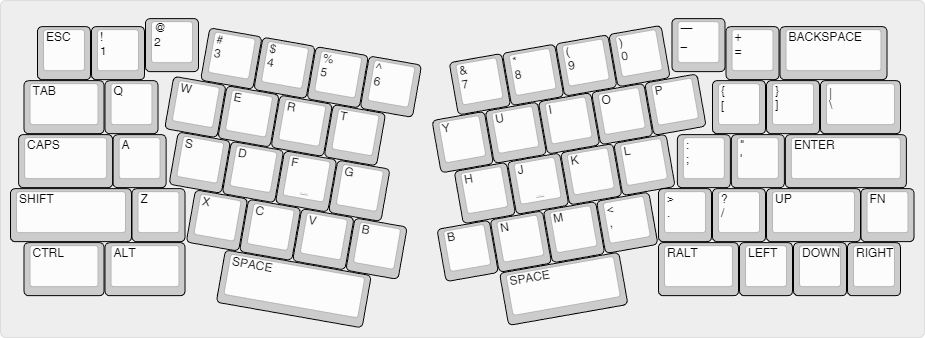
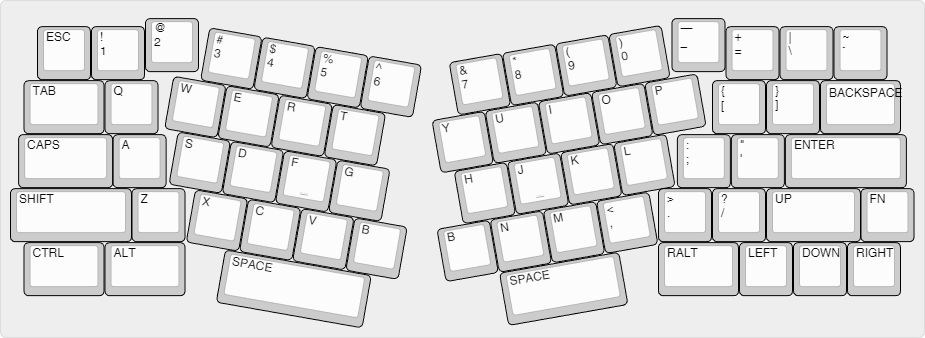

# Osmanthus

A QMK based custom keyboard with modified Alice layout.

___Working in process...___

## Layouts

_Layout 1_

_Layout 2 (split backspace)_

## Related

- [QMK Firmware](https://github.com/qmk/qmk_firmware)
- [Arisu Keyboard](https://github.com/FateNozomi/arisu-pcb)
- [Keyboard Layout Editor](https://github.com/ijprest/keyboard-layout-editor)
- [Keyboard Automated Design](https://github.com/swill/kad)
- [Keyboard Firmware Builder](https://github.com/ruiqimao/qmkbuilder)
